```{r setup, include=FALSE}
options(htmltools.dir.version = FALSE)
```

class: inverse, center, middle

# Rstudio

### Interfaz de desarrollo de R

---
class: center, middle

# Rstudio

Es una interfaz que facilita el desarrollo en R ya que integra en una pantalla
diferentes paneles que interactuan entre sí.

<br>

.left[
>Por ejemplo permiten ejecutar en uno de ellos los comandos del script que tenemos en otro panel, 
para visualizar el grafico en otro panel.

]

---

# Rstudio

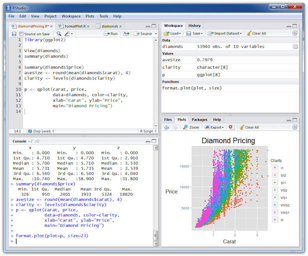

---

# Rstudio

Para hacer uso de este software se requiere:

- R base instalado

- Se ejecuta localmente 

- Cada paquete necesario se debe instalar localmente

<br>
<br>

.center[
## ¿Alternativas?
]

---
class: inverse, center, middle

# Rstudio Cloud

### Rstudio en línea

---
class: center, middle

# Rstudio Cloud

Esta versión de Rstudio conserva la misma funcionalidad y estructura, pero tiene la ventaja
de ejecutarse en un servidor por lo que la configuración es casí nula. Ademas al ejecutarse en 
el navegador se puede usar en casí cualquier dispositivo.

---

# Rstudio Cloud

.pull-left[
### Pros

- No necesita instalación
- Tiene la versión de R mas reciente
- Pueden convivir diferentes versiones de R
- Configuración sencilla
- Instalación de paquetes sencilla
- Facilita compartir ambientes de trabajo
- Se puede ejecutar tabletas y telefonos

]

.pull-right[
### Contras
- Necesita internet para ejecutarse
- No tiene mucho poder de computo (en la versión gratuita)
- Para usar archivos en el espacio de trabajo se necesita subirlos al servidor
- El número de proyectos es limitado
- Interacción con archivos locales

]

---

# Rstudio Cloud

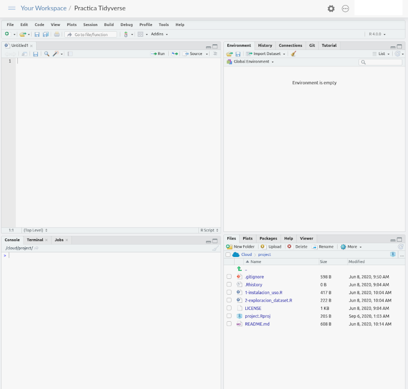

---

# Rstudio Cloud

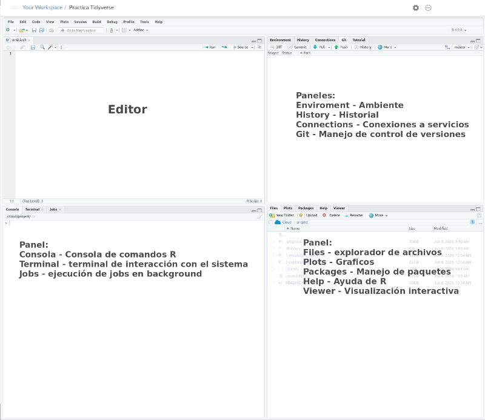

---

# Rstudio cloud
## Registro

.pull-left[
Es recomendable el uso de la plataforma de **Google** o **Github** para realizar la alta.

Esto permite disminuir el número de paswords que usamos y puede ser mas seguro siempre que la cuenta
de enlace tenga un buen password e incluso autenticación de dos pasos.
]

.pull-right[
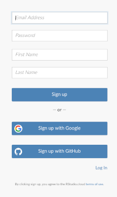
]

---
class: inverse, center, middle

# Rstudio cloud

### Interacción con el **Workspace**

---

# Rstudio cloud

Hay dos interacciones importantes que debemos conocer, el acceso a los datos y el uso de los resultados.

### Entrada de datos
Interactuar requiere:

- Subir los archivos al espacio de trabajo
- Poner los datos disponibles en línea

### Salida de datos
Para usar los resultados y gráficas, podemos descargar un archivo del espacio de trabajo o copiar una imagen 
del gráfico generado

---

# Rstudio cloud

### Subir archivos

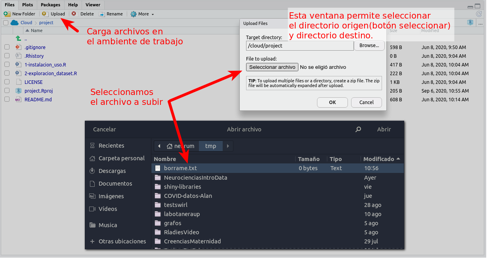

---

# Rstudio Cloud

### Descargar archivo 

.pull-left[
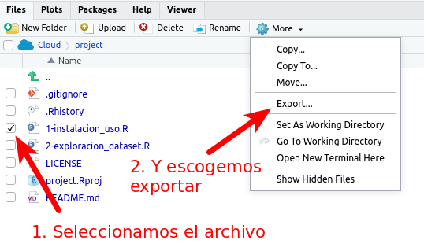
]

.pull-right[
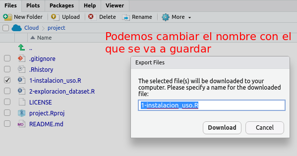
]

---

# Rstudio Cloud

### Exportar gráficos

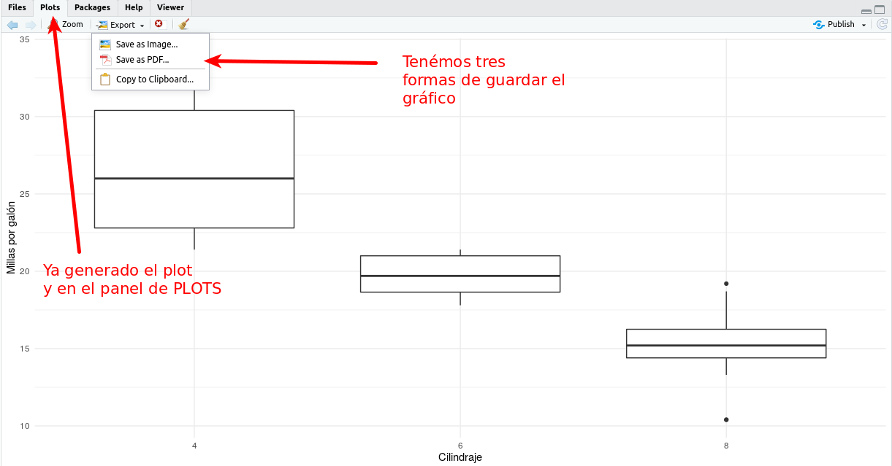

---

# Rstudio Cloud

### Copiar a Clipboard

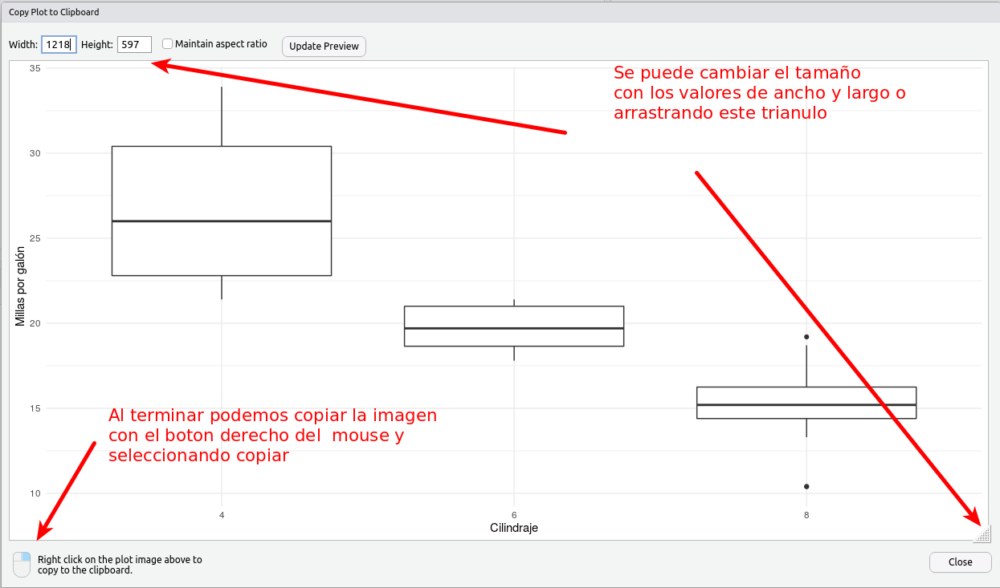

---

# Rstudio Cloud

### Guardar como imagen

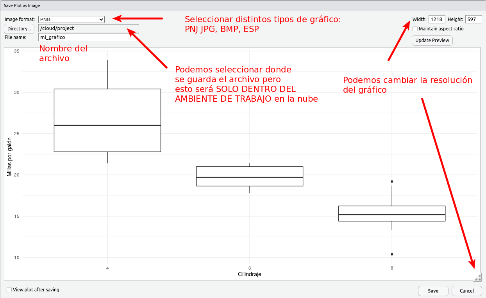


---

# Rstudio Cloud

### Guardar como PDF<sup>*</sup>

.pull-left[
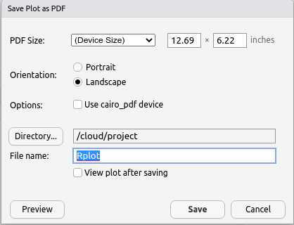
]

.pull-right[
En este caso se genera un archivo PDF e igualmente se guarda en el espacio de trabajo en el servidor de Rstudio Cloud
]

.footnote[<sup>*</sup> Al guardarse en el servidor se requiere __Descargar Archivo__]

---

# Rstudio Cloud
### Lectura directa de los datos

.pull-left[
  Se pueden subir los datos de forma directa mediante el menu **Import Dataset**
  que nos permite leer directamente un set de datos que tengamos en nuestro equipo<sup>*</sup>.
]

.pull-right[
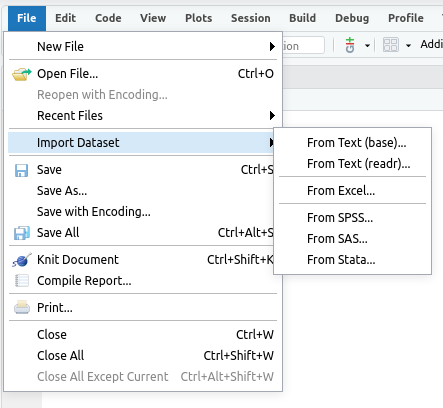
]

.footnote[<sup>*</sup> Algunos de los formatos que vienen en la lista requieren la instalación de paquetes.]
